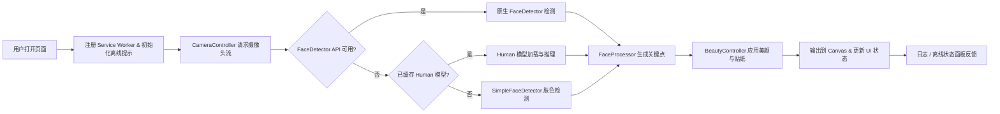

# Beauty Face

- [English Version](readme_en.md)

一个基于原生 Web API 的 H5 美颜换脸 Demo，支持实时摄像头预览、趣味贴纸、美颜调节、离线模型管理以及 Service Worker 离线缓存。页面自动适配手机与桌面浏览器，推荐在 Chrome 或 Safari 等支持摄像头的浏览器中访问。

## 快速开始

```bash
# 启动本地静态服务器
npx http-server public
# 或者使用 Python 内置服务器
python -m http.server --directory public 4173
```

通过 `http://localhost:8080`（或命令行输出的端口）访问页面。请在 HTTPS 或 `localhost` 环境下打开，否则浏览器将拒绝摄像头与 FaceDetector API 权限。

## 功能概览

- **实时摄像头取景**：顶部 80% 区域实时展示视频流，支持缩放、前后摄像头切换与闪光灯控制（取决于硬件能力）。
- **趣味滤镜与人脸轮廓**：内置小狗脸贴纸与人脸轮廓描绘，可在控制面板中随时启用/停用。
- **美颜调节**：提供美白、瘦脸、大眼、自动美妆滑杆，实时作用于画面。
- **模型管理**：`检查模型更新` 按钮调用 `ModelManager`，按 manifest 下载 Human 模型并保存到 IndexedDB 以便离线使用。
- **离线体验与日志**：支持一键启用离线模式、查看 Service Worker 缓存状态及系统日志输出面板。

## 核心技术亮点

1. **多层人脸检测回退策略**：优先调用原生 `FaceDetector`，不可用时尝试 `@vladmandic/human` 模型，仍失败则使用基于肤色聚类的 `SimpleFaceDetector`，保证在弱网络或权限受限场景仍可提供基础效果。
2. **灵活的模型加载与缓存**：`ModelManager` 利用 `IndexedDB` 与 `Cache Storage` 缓存模型与元数据，结合 `scripts/download_models.py` 支持预下载与多 CDN 回源，确保离线运行稳定。
3. **渐进式美颜渲染管线**：通过双 Canvas（源画布与输出画布）完成绘制，在同一帧中先进行人脸检测，再叠加美颜、瘦脸、大眼与贴纸层，保证画面实时性与流畅度。
4. **可控的离线模式切换**：离线开关会注册/注销 Service Worker、清理相关缓存并动态更新提示文案，使用户能够显式管理离线状态。

## 技术栈

| 模块 | 技术 | 说明 |
| --- | --- | --- |
| 前端框架 | 原生 HTML / CSS / ES Modules | 无第三方框架，轻量级部署。 |
| 摄像头访问 | `MediaDevices.getUserMedia`、`MediaStreamTrack.applyConstraints` | 获取视频流、控制缩放与闪光灯。 |
| 人脸检测 | `FaceDetector` API、`@vladmandic/human`、自研肤色检测 | 根据可用性动态切换检测器。 |
| 渲染 | `<canvas>` 2D 上下文 | 双画布渲染管线、滤镜叠加。 |
| 离线能力 | Service Worker、Cache Storage、IndexedDB | 控制面板开关离线、缓存模型与静态资源。 |
| 模型管理 | `scripts/download_models.py` | 预下载 Human 模型，支持多镜像与强制更新。 |

## 技术流程图



## 模型与素材

- Human 模型默认从 `public/models` 读取，如需最新版本可执行：

  ```bash
  python scripts/download_models.py
  ```

- 脚本会按照官方 [`@vladmandic/human-models`](https://www.npmjs.com/package/@vladmandic/human-models) manifest 下载所有 JSON 和权重文件，支持 `--force` 重新拉取。
- 运行 Demo 时若检测到模型缺失，会提示下载或切换到简单检测器。

## 离线运行指南

1. 勾选控制面板中的「启用离线运行」，系统会注册 Service Worker、预缓存核心资源并在日志面板记录状态。
2. 若需要清理离线缓存，可关闭开关，应用会注销 Service Worker 并删除以 `beauty-face-cache` 前缀命名的缓存。
3. 首次启用离线运行前建议在联网状态下执行模型下载脚本或点击「检查模型更新」，确保 Human 模型可离线访问。

## HTTPS 启动指南

在仅有 IP 的环境中需要自签名证书以启用 HTTPS，可参考以下步骤生成证书并在本地服务器绑定：

1. **生成自签名证书（包含 IP Subject Alternative Name）**

   ```bash
   export TARGET_IP=<ip_address>

   cat >openssl.cnf <<'CERT'
   [req]
   default_bits       = 2048
   prompt             = no
   default_md         = sha256
   req_extensions     = req_ext
   distinguished_name = dn

   [dn]
   C  = CN
   ST = Local
   L  = Dev
   O  = BeautyFace
   OU = Lab
   CN = ${TARGET_IP}

   [req_ext]
   subjectAltName = IP:${TARGET_IP}
   CERT

   openssl req -x509 -nodes -days 365 -newkey rsa:2048 \
     -keyout beauty_face.key -out beauty_face.crt -config openssl.cnf
   ```

2. **信任证书**：在 macOS、Windows 或 Linux 中导入 `beauty_face.crt` 并设为受信任证书。
3. **启动 HTTPS 服务**：

   ```bash
   npx http-server public --ssl --cert beauty_face.crt --key beauty_face.key --host 0.0.0.0 --port 8443
   # 或者
   python -m http.server 8443 --directory public --bind 0.0.0.0 \
     --ssl-certfile beauty_face.crt --ssl-keyfile beauty_face.key
   ```

4. **访问页面**：在浏览器中打开 `https://<ip_address>:8443`，确认地址栏显示安全锁图标。

> 如需支持多个 IP 或域名，可在 `subjectAltName` 中追加条目，例如 `subjectAltName = IP:192.168.0.10,IP:127.0.0.1,DNS:example.com`。

### 使用 mkcert 快速签发证书

如果已安装 [mkcert](https://github.com/FiloSottile/mkcert)，可使用以下命令生成证书并启动项目：

```bash
mkcert -install
mkcert 192.168.50.146
npx http-server public \
  --ssl \
  --cert 192.168.50.146.pem \
  --key 192.168.50.146-key.pem \
  --host 0.0.0.0 \
  --port 8443
```

## 目录结构

- `public/index.html`：应用入口与控制面板布局。
- `public/styles.css`：样式与响应式布局规则。
- `public/app.js`：摄像头、检测、渲染、离线逻辑核心实现。
- `public/service-worker.js`：静态资源预缓存与离线回退。
- `public/models/`：模型 manifest 与示例配置，脚本会将权重写入此处。
- `scripts/download_models.py`：Human 模型下载脚本。

## 浏览器支持

- 建议使用最新版 Chrome 或 Safari。
- 当 `FaceDetector` API 不可用时，自动回退到 Human 模型或肤色检测方案，基础滤镜功能仍然有效。

## 授权许可

MIT
