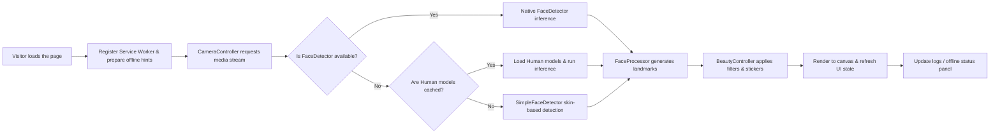

# Beauty Face (English)

- [中文说明](README.md)

Beauty Face is a pure Web API powered face beautification demo for mobile and desktop browsers. It delivers real-time camera preview, playful stickers, adjustable beauty filters, offline model management, and Service Worker driven offline caching. The UI is responsive and works best in browsers that can access the camera such as Chrome or Safari.

## Quick Start

```bash
# Launch a local static server
npx http-server public
# Or use Python's built-in server
python -m http.server --directory public 4173
```

Open `http://localhost:8080` (or the port printed by the CLI). The page must be served over HTTPS or from `localhost` so that the browser grants camera access and allows the FaceDetector API.

## Feature Highlights

- **Live camera viewport**: The top 80% of the screen shows the video stream and exposes zoom, camera switch, and torch controls (depending on device capabilities).
- **Fun overlays and face outline**: Toggle a puppy-face sticker and real-time face outlines directly from the control panel.
- **Beauty adjustments**: Tune whitening, face slimming, big-eye, and auto-makeup sliders; the filters are applied instantly on each frame.
- **Model management**: The `Check model updates` button invokes the `ModelManager`, downloads Human models defined in the manifest, and stores them in IndexedDB for offline use.
- **Offline mode & logs**: A dedicated switch enables offline mode, registers the Service Worker, and surfaces cache status plus a live system log panel.

## Key Technical Concepts

1. **Layered face detection fallback** – The app prefers the native `FaceDetector`, falls back to `@vladmandic/human` models when necessary, and ultimately relies on a custom skin-tone based `SimpleFaceDetector` to retain basic functionality in restricted environments.
2. **Robust model loading and caching** – `ModelManager` combines `IndexedDB` and `Cache Storage` to persist model binaries and metadata, while `scripts/download_models.py` prefetches assets from multiple CDN mirrors for reliable offline execution.
3. **Progressive beauty rendering pipeline** – Two canvases (source and output) compose each frame: capture, detect faces, apply beauty filters, draw stickers, and update UI indicators without dropping frames.
4. **Controlled offline toggle** – Switching offline mode dynamically registers or unregisters the Service Worker, cleans related caches, and updates user-facing hints so visitors know the exact offline state.

## Tech Stack

| Layer | Technology | Purpose |
| --- | --- | --- |
| UI foundation | Native HTML / CSS / ES Modules | Lightweight deployment without frontend frameworks. |
| Camera access | `MediaDevices.getUserMedia`, `MediaStreamTrack.applyConstraints` | Retrieve video streams, manage zoom, and control the torch. |
| Face detection | `FaceDetector` API, `@vladmandic/human`, custom skin detector | Dynamically select the best detector per environment. |
| Rendering | `<canvas>` 2D context | Dual-canvas pipeline and layered effects. |
| Offline support | Service Worker, Cache Storage, IndexedDB | Toggle offline mode, cache assets and model binaries. |
| Model tooling | `scripts/download_models.py` | Pre-download Human models with multi-mirror fallback and force refresh. |

## Architecture Flow



## Models and Assets

- Human models are read from `public/models` by default. Download the latest files with:

  ```bash
  python scripts/download_models.py
  ```

- The downloader follows the official [`@vladmandic/human-models`](https://www.npmjs.com/package/@vladmandic/human-models) manifest and supports the `--force` flag to refresh files.
- When models are missing, the demo guides users to download them or switches to the lightweight detector automatically.

## Offline Mode Guide

1. Toggle **Enable offline mode** in the control panel to register the Service Worker, precache core assets, and log progress in the console panel.
2. Disable the switch to remove the Service Worker and delete caches whose keys start with `beauty-face-cache`.
3. Run the model download script or click **Check model updates** while online so the Human detector can work without a network connection.

## HTTPS Setup Guide

For HTTPS-only environments (for example, IP-based intranets) you can issue a self-signed certificate and bind it to your local server:

1. **Create a self-signed certificate (with IP Subject Alternative Name)**

   ```bash
   export TARGET_IP=<ip_address>

   cat >openssl.cnf <<'CERT'
   [req]
   default_bits       = 2048
   prompt             = no
   default_md         = sha256
   req_extensions     = req_ext
   distinguished_name = dn

   [dn]
   C  = CN
   ST = Local
   L  = Dev
   O  = BeautyFace
   OU = Lab
   CN = ${TARGET_IP}

   [req_ext]
   subjectAltName = IP:${TARGET_IP}
   CERT

   openssl req -x509 -nodes -days 365 -newkey rsa:2048 \
     -keyout beauty_face.key -out beauty_face.crt -config openssl.cnf
   ```

2. **Trust the certificate** on macOS, Windows, or Linux by importing `beauty_face.crt` into the system trust store.
3. **Start an HTTPS server**:

   ```bash
   npx http-server public --ssl --cert beauty_face.crt --key beauty_face.key --host 0.0.0.0 --port 8443
   # or
   python -m http.server 8443 --directory public --bind 0.0.0.0 \
     --ssl-certfile beauty_face.crt --ssl-keyfile beauty_face.key
   ```

4. **Visit the app** at `https://<ip_address>:8443` and ensure the lock icon appears in the address bar.

> Need multiple IPs or hostnames? Add more entries inside `subjectAltName`, e.g. `subjectAltName = IP:192.168.0.10,IP:127.0.0.1,DNS:example.com`.

### Issue certificates quickly with mkcert

If [mkcert](https://github.com/FiloSottile/mkcert) is installed, run:

```bash
mkcert -install
mkcert 192.168.50.146
npx http-server public \
  --ssl \
  --cert 192.168.50.146.pem \
  --key 192.168.50.146-key.pem \
  --host 0.0.0.0 \
  --port 8443
```

## Project Structure

- `public/index.html`: Entry page and control panel layout.
- `public/styles.css`: Styles and responsive layout rules.
- `public/app.js`: Core camera, detection, rendering, and offline logic.
- `public/service-worker.js`: Static asset precaching and offline fallbacks.
- `public/models/`: Model manifest and sample configs; the downloader stores weights here.
- `scripts/download_models.py`: Human model downloader script.

## Browser Support

- Tested on the latest Chrome and Safari.
- When the `FaceDetector` API is unavailable, the app automatically falls back to Human or the simple detector so beauty effects remain functional.

## License

MIT
